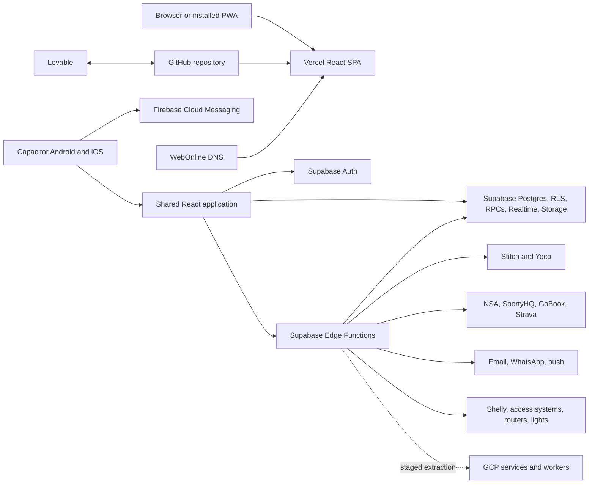

# SquashHub Architecture

Last verified against the repository on 2026-08-25.

## System purpose

SquashHub is a multi-tenant platform for squash clubs and the wider squash ecosystem. It combines club SaaS, member self-service, bookings, competitions, league/federation operations, payments, communications, access automation, live scoring, PWA delivery, and native mobile capabilities in one codebase.

## Runtime context

## Application shells and routing

`src/App.tsx` composes providers in this order: React Query, UI providers, router, Auth, Club, and Member. The order matters because club and member state depend on authentication.

The application serves multiple shells:

- Public/root product experience and club directory.
- Club landing pages resolved from host subdomains or `/c/:subdomain` paths.
- Authenticated member shell with bookings, ladder, matches, profile, feed, achievements, availability, notifications, support, and help.
- Club administration for courts, members, events, competitions, finance, communications, and settings.
- Platform administration under `/admin` for clubs, federation, tournaments, users, affiliations, NSA imports, outreach, subscriptions, support, and platform configuration.
- Public or tokenized payment, invitation, unsubscribe, booking response, TV, and live marker routes.

`src/lib/subdomain.ts` resolves the active club from preview state, path routing, hostname, and custom-domain behavior. Platform admin must remain on the root host.

## Identity and authorization

`AuthContext` owns the Supabase user and session. `ClubContext` resolves the active public and restricted club context. `MemberContext` resolves member records and the user's relationship to the club.

Authorization spans:

- platform super-admin roles;
- organization and association administrators;
- club roles and custom permissions;
- member access and status gates;
- club capabilities and subscription packaging;
- public/tokenized workflows;
- RLS and privileged Edge Functions.

UI gates improve navigation but do not replace RLS or server-side authorization.

## Core domain model

### Organizations and people

`organisations`, `clubs`, `people`, private people data, affiliations, profiles, club members, association memberships, organization relationships, roles, permissions, and audit events establish identity and organizational structure.

### Bookings and facilities

`courts`, `bookings`, recurring bookings, booking invites, visitors, reflow logs, light sessions, access events, router configurations, and access provisioning logs connect scheduling to physical facilities.

### Matches, ladders, and rankings

Matches, challenges, ladder history, ranking ledgers, pending ranking points, streaks, badges, and correction/dispute records form the player competition history.

### Tournaments and club championships

Tournaments, venues, rules, governance, draw versions, rounds, entries, doubles pairs, marker locks, schedules, and invite delivery support multiple formats. Pure domain behavior is concentrated in `src/lib/tournaments/` and `src/lib/tournament-formats/` and is heavily tested.

### Leagues and federation

League associations, seasons, rules, teams/pairs, rounds, fixtures, lineups, availability, results, penalties, national bodies, affiliations, licenses, and NSA history support club-to-federation workflows.

### Billing, payments, and bar

Member fees, fee categories, club subscriptions, platform invoices, mandates, payment sessions, collections, payable batches, ledger entries, bar items, stock, tabs, and visitor sales connect club operations to finance.

### Communications and engagement

Campaigns, recipients, templates, email outbox/state, suppression, notifications, push subscriptions, WhatsApp interactions, feed posts, comments, reactions, outreach prospects, links, and event tracking support engagement and growth.

## Backend architecture

### Supabase data plane

The browser and native app use Supabase clients for authenticated data access. RLS is therefore a primary security control. The migration history is large and encodes schema, security policies, RPCs, cron jobs, triggers, and operational fixes. Always add migrations; never rewrite applied history.

Realtime is important for bookings, live markers, notifications, and operational dashboards. New subscriptions must be narrowly filtered and cleaned up on navigation or context changes.

### Edge Functions

Edge Functions implement privileged and integration-heavy workflows, including:

- payments, mandates, collections, callbacks, and reconciliation;
- NSA/federation sync, fixture and result exchange, and member provisioning;
- email, WhatsApp, push, campaigns, outreach, and queue processing;
- access provisioning, court lights, Shelly devices, router polling, and diagnostics;
- GoBook, SportyHQ, Strava, and other external integrations;
- subscriptions, invoicing, billing, and trial notifications;
- public booking, invite, visitor, and token workflows.

Functions must validate callers, tenant/club scope, provider signatures, and idempotency before privileged writes.

## Web, PWA, and native architecture

The React app is shared across web and Capacitor. Platform-specific helpers encapsulate deep links, native browser behavior, BLE, push, orientation, geolocation, and local notifications.

- Web/PWA push uses service workers and VAPID.
- Native push uses Firebase Cloud Messaging through Capacitor plugins.
- Mobile OAuth and payment flows may open external browser surfaces and return through deep links.
- Android and iOS projects are synchronized from the web build with Capacitor.

See `MOBILE.md` and Android docs before editing native configuration.

## Deployment and operations

- The web application deploys from `main` to Vercel where configured.
- WebOnline manages product and wildcard tenant DNS.
- Supabase migrations, functions, secrets, and cron schedules deploy separately.
- Capacitor native builds have separate signing, store, Firebase, and release processes.
- Lovable may generate commits and uses connected cloud APIs in parts of the codebase.
- Remotion is a separate tooling surface and should not be included in the main app bundle accidentally.

## Migration direction: Supabase to GCP

The safest extraction sequence is workload-first:

1. Define typed boundaries around external providers and scheduled jobs.
2. Move polling, queue processing, outreach, notification dispatch, media work, and device orchestration to authenticated Cloud Run services or workers where justified.
3. Use Pub/Sub or Cloud Tasks only where delivery semantics, retries, ordering, and dead-letter behavior are explicitly designed.
4. Publish outbox events from the current source-of-truth transaction instead of dual-writing from UI code.
5. Build reconciliation views for payments, bookings, access events, notifications, and federation sync.
6. Migrate primary competition or booking data only after realtime, latency, offline, and rollback requirements are proven.

GCP already participates indirectly through Firebase and Google OAuth configuration, but this does not mean the main backend has migrated.

## Architectural risks

- The product has a very large schema and Edge Function surface, increasing coupling and deployment-order risk.
- Device and external sports integrations are unreliable by nature and need observability and safe retries.
- One shared application serves public, member, club-admin, association, platform, PWA, and native use cases.
- Subdomain, preview, path-based, and custom-domain routing can diverge.
- Payment and competition workflows have complex state transitions across tables and functions.

The strongest mitigation is to preserve domain libraries and tests, centralize integration boundaries, enforce tenant scope, and add reconciliation rather than hidden retries.

## Change impact checklist

- club, organization, member, and platform authorization;
- RLS, RPCs, migrations, generated types, and cron jobs;
- tournament/league invariants and test coverage;
- booking, access, lights, router, and visitor side effects;
- payment verification, idempotency, and reconciliation;
- web, PWA, Android, iOS, deep links, and push;
- subdomains, custom domains, Vercel, and WebOnline DNS;
- external provider contracts, quotas, and credentials;
- GCP extraction contracts, logs, retries, cost, and rollback.
